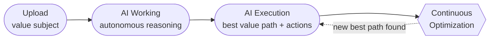
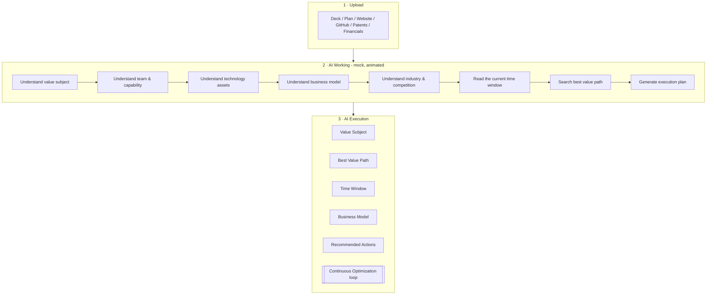
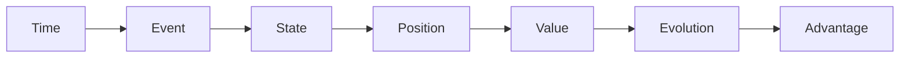

# VEI — Product Flow

## User-facing flow (3 stages)

## Stage detail

## Backend reasoning engine (illustrative)

> V0.1 visualizes this chain as animation only — no real inference is performed.
> All demo data is mock data.
